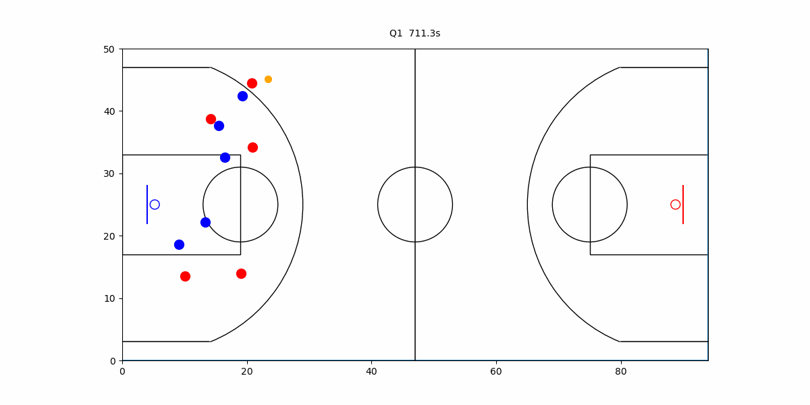
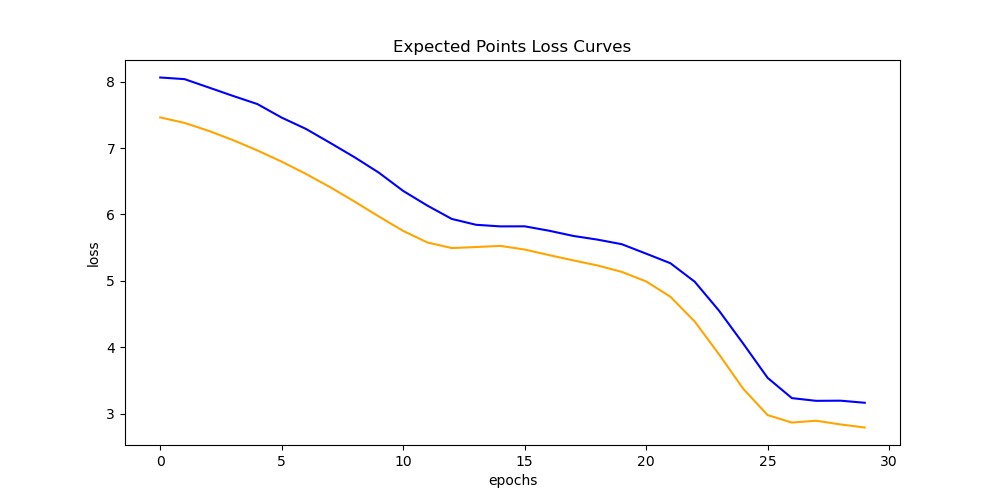
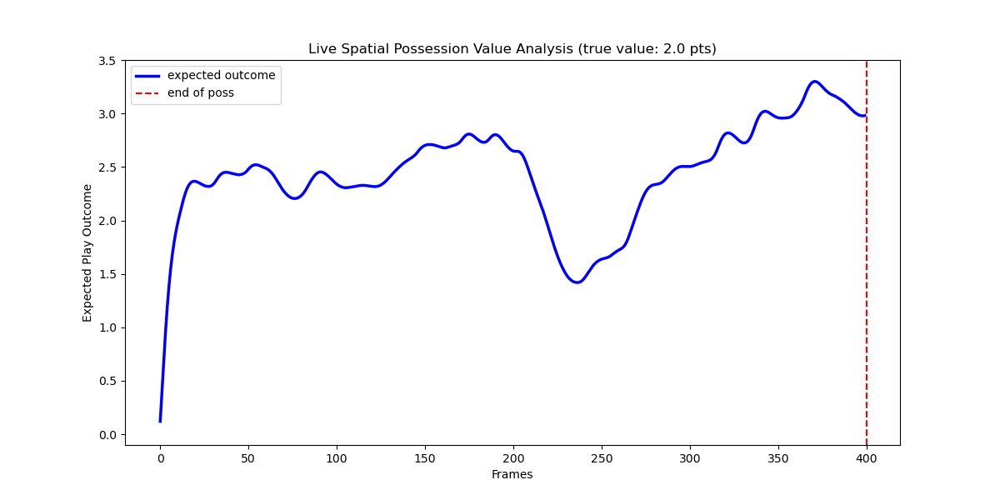

# NBA Player Tracking
## Project Overview
This project looks at NBA tracking data in order to determine credit and blame on individual plays.

## Instructions

To install: pip install git+https://github.com/holthenry/DSCI410L_pbp  
OR clone and pip install .

Then run the evaluation.ipynb or

from train_models import training_loop, get_data_loaders  
from model import ExpectedPointsLSTM

train_loader, val_loader = get_data_loaders(dir='./games', batch_size=_, files=_, shuffle=False)
model, loss = training_loop(train_loader=train_loader, val_loader=val_loader, epochs=30, lr=1e-4)

The 'files' argument determines how many games should be downloaded and the 'shuffle' argument is whether or not games should be chosen at random.

## Data Overview
The data comes from the 2015-16 SportVU tracking data. This is the last year that the data was made public. This is combined with [play-by-play data](https://github.com/sumitrodatta/nba-alt-awards/blob/main/Historical/PBP%20Data/2015-16_pbp.csv) from the same season. The tracking data can be found [here](https://github.com/linouk23/NBA-Player-Movements/tree/master). Below is an example of one 'event' (essentially a possession), which due to the size of the files cuts off after a few seconds.

In order to run the dataset through a deep learning model, there were a number of required preprocessing steps. Thankfully, the play-by-play and tracking data have some shared data. Both contain the unique game ID as well as an event number which was a count of the number of events to happen in a given game. The first step was to create a new column which counted the number of possessions. I defined this by simply incramenting each time the offensive team became the defensive team (in reality this is when a shot or last free throw is made, a turnover occurs, or a defensive rebound occurs). The goal was to create a column in the play-by-play dataset which kept track of how many points were scored on each possession. I acheived this by keeping track of the score (which was recorded in the play-by-play dataset) and subtracting the away and home score at the end of the possession from the score at the start of the possession. This gave me a reliable variable that I could try to predict. After that (with some help from gen AI), I was able to merge the play-by-play data with the tracking data. The main issue was that while the play data was all in one csv, there are over 600 zipped tracking files in a folder that are too large to be downloaded. So I extracted them from GitHub inside of a loop and performed the transformations on them inside of the loop before saving them locally in a folder. This also allowed me to extract 10-20 to work with, which gave me more data but wasn't strenuous. Once I was able to process the data, I had to fit it to the model. I chose an LSTM because of its ability to learn sequential data. This is hugely important for tracking data which is reliant on context.
## Results
The main challenge was combatting overfitting and unrealistic predictions. The issue with this project is that in terms of scoring there are only five possible ways that a possession can end (0, 1, 2, 3, 4 points). A classification problem may have been superior, but that felt more like predicting the overall outcome of a possession rather than a second-to-second comparison. Both would have been interesting.
The loss on the training (blue) and validation (red) sets look as such:

I ended up using SmoothL1Loss when trying to reduce the tendency to predict 0 for every timestep. I was originally using MSE, but that was punishing incorrect higher predictions too much. The thing to consider is that 95% of the time nobody is scoring, so when you are trying to predict the expectation of scoring it is very safe to predict 0. When many possessions end in no points, predicting three and getting it wrong is a huge loss. This made the predictions more realistic. Another fix that I used was that I weighted the higher scoring plays so that the model would actually make predictions early in the shot clock (rather than just 0). 
Below is an example of the predicted points outcome from a possession. 

Overall, the results from the expected points prediction are mixed. The output is interestingly varied (it doesn't just predict 0 or 1.5 every time), though I would say that it predicts between 2-3 more often than not. It doesn't seem capable of understanding when a possession isn't going anywhere. The loss is not very good either, though I suspect things like these are difficult to predict.
## Takeaways
My greatest takeaway is that when someone says that you're working on a 10 week project you should spend more time on it than I ended up spending. I wasn't able to accomplish my main goal in time, which is disappointing. In order to divide up credit and blame, I would have to put many more hours into this project. This would include figuring out a good way to divide up the credit as well as improving my expected points model. I also considered using the text from the play-by-play data in the model, and while this may have worked that text data was much more sparse than the tracking data.
